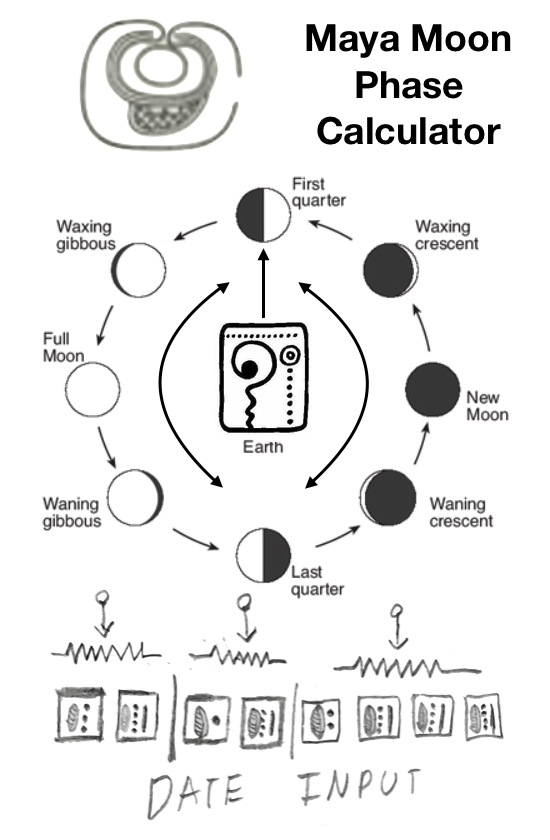
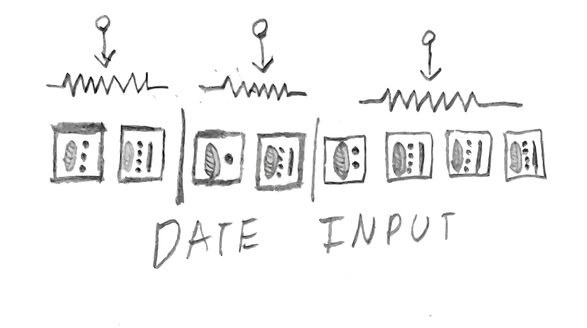
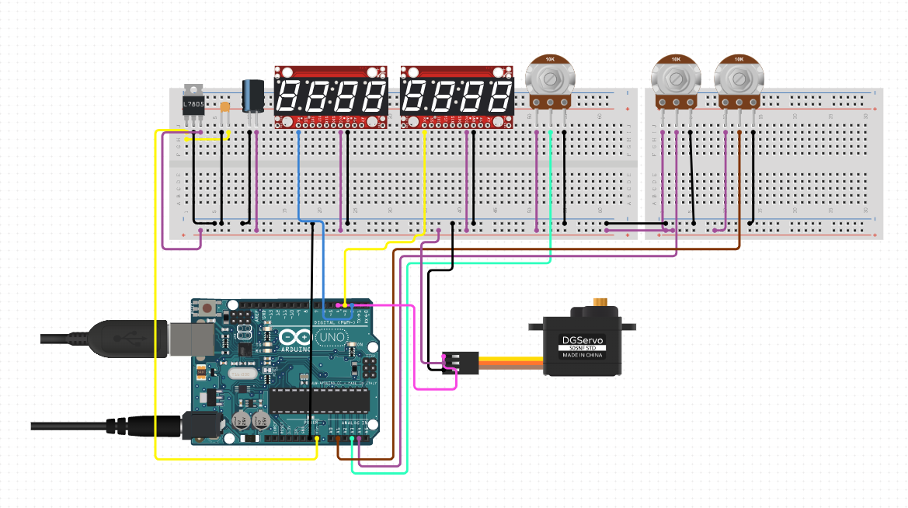
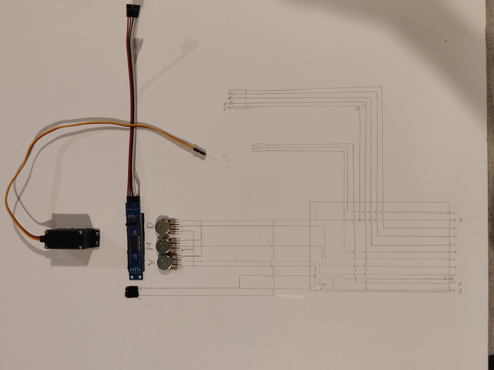
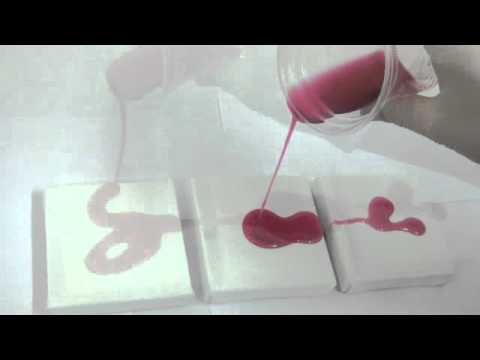
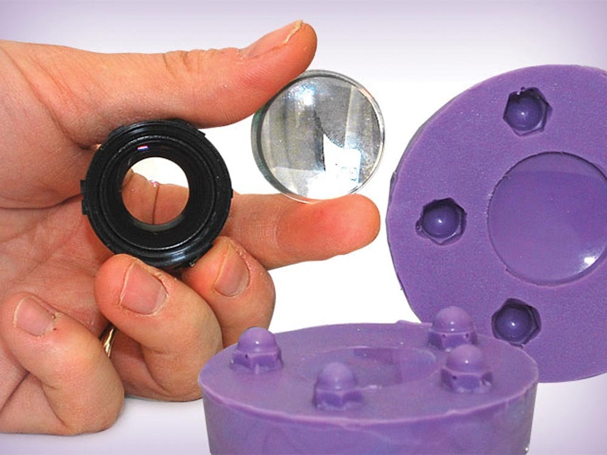
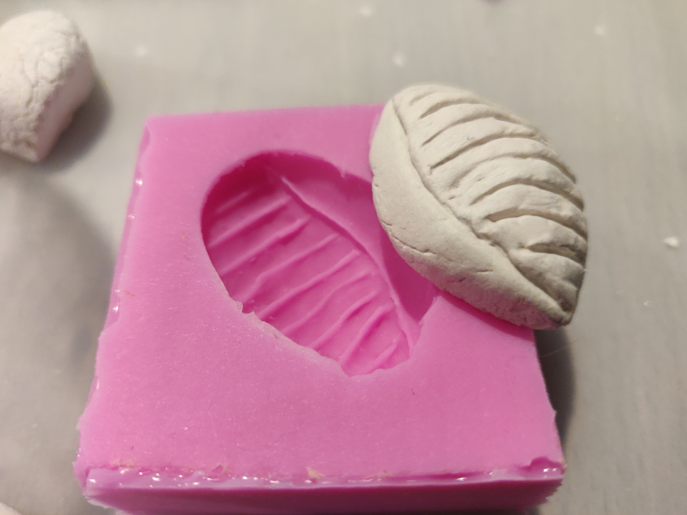
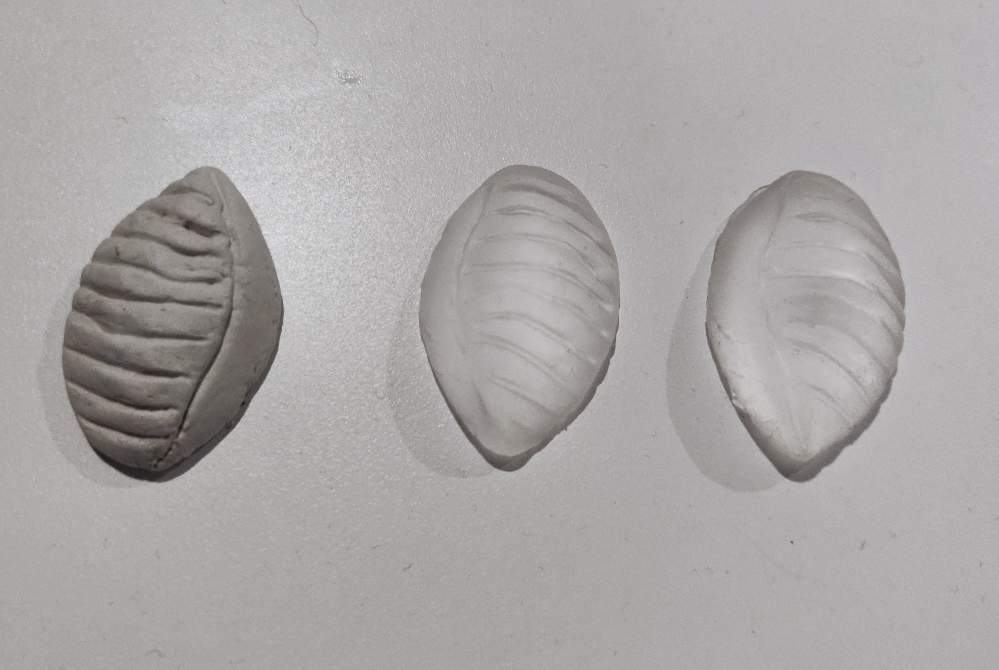

# 7515QCA Final project journal: *Akshya Aravind Anand*

## Mayan Moon Phase Calculator (Prototype Version) ##

## Related projects ##

### Solar System Orrery (3D Printed) ###

*https://www.instructables.com/id/Solar-System-Orrery-3D-Printed/*

*An orrery is a mechanical model of the solar system that illustrates or predicts the relative positions and motions of the planets and moons, usually according to the heliocentric model. My project reflects these positions as phases denoting the position according to the day observed from
This project helped me visualize a design concept for my idea on how to represent the phases of the moon by spreading out the positions arround a model of the earth in the center*.

### DIY MAYAN CALENDAR ###

*https://woodtrick.com/product/mayan-calendar/*

This project initally sparked my interest behind making a celestial body phase calculator, the mayan calendar is designed with the perspective that the earth was in the center of the solar system and indicated the turn of yearly and monthly cycles based on the phases of the moon and sun from the view of an observer from the earth*.

### School Countdown Calendar ###

*https://www.instructables.com/id/School-Countdown-Calendar/*

This project has an LCD screen displaying the end date/time for the countdown, utilizes three 4-digit 7-segment display units connected to an Arduino Mega to utilize all the additional I/O pins. This project utilises a very similar the method I'll be trying to use in indicating the input date of the phase calculator using the 8 digits from the display. 

## Other research ##

## Mould making and Casting Techniques ##
*https://www.smooth-on.com/tutorials/*

* I intend on casting traditional symbols that the maya used to denote the moon and the sun, along with the number system they followed to indicate the date input. Mouldmaking/casting involves covering the object you want to copy in a material which will then become firm enough to be detached from it and keep its shape, so that a hollow space or negative of the object is left, which can then be filled with a casting material to make an exact replica of the shape.*

## Moon phases calculation algorithm ##
*https://gist.github.com/L-A/3497902*

* This is a pseudo code I found written in javascript that I intend on using to calculate that phase of the moon with the date as the input. Although I would have to translate this to java in order to implement the code within Arduino*

## Conceptual progress ##

### Design intent ###
*The design intent of this project is to showcase a thematic interactive intallation that calculates and visualizes the phase of the moon based on the date given by the user, styled in traditional mayan symbolic art.*

### Design ideation ###
<!--- Document your ideation process. This will include the design concepts presented for assessment 2. You can copy and paste that information here. --->

### Final design concept ###

*The diagram above depicts the overall outlook of the model from the position of the arrow gauge petruding from the middle earth symbol indicating the phase of the moon by rotating towards the assossiated phase position.*

*The diagrams above depict the two possible concepts behind the date input method, one where the potentiometer knobs .*

### Interaction flowchart ###

## Process documentation ##

*The Image above shows the circuit diagram plotted on top of the boad in which all of the elements of the project were assembled on.*

*The two main fabrication materials I've planned on using for this project ar clear casting epoxy and air drying clay. The epoxy requires the additional use of sillicone in order to make moulds for the casting process as epoxy tends to stick to raw clay moulds.*

*The Images above show the mould making and casting experiments carried out for the project*

*Digital Display Test:*

*Digital Display Test:*

## Final code ##

#include "LedControl.h"
#include <Servo.h>

Servo myservo;

LedControl lc = LedControl(12, 13, 10, 1);
int dayPin = A0;
int monthPin = A1;
int yearPin = A2;
const int buttonPin = 2;

int buttonState = 0;
int buttval;

int dayval = 0;
int monthval = 0;
int yearval = 0;

int servoval = 0;
float phase = 0;
/* we always wait a bit between updates of the display */
unsigned long delaytime = 250;

void setup() {
  //  Serial.begin(9600);

  lc.shutdown(0, false);
  lc.setIntensity(0, 8);
  lc.clearDisplay(0);

  myservo.attach(9);

  pinMode(buttonPin, INPUT);
}

int JulianDate(int d, int m, int y)
{
  int mm, yy;
  int k1, k2, k3;
  int j;

  yy = y - (int)((12 - m) / 10);
  mm = m + 9;
  if (mm >= 12)
  {
    mm = mm - 12;
  }
  k1 = (int)(365.25 * (yy + 4712));
  k2 = (int)(30.6001 * mm + 0.5);
  k3 = (int)((int)((yy / 100) + 49) * 0.75) - 38;
  // 'j' for dates in Julian calendar:
  j = k1 + k2 + d + 59;
  if (j > 2299160)
  {
    // For Gregorian calendar:
    j = j - k3; // 'j' is the Julian date at 12h UT (Universal Time)
  }
  return j;
}

float MoonPhase(int d, int m, int y)
{
  int j = JulianDate(d, m, y);
  float ip;
  //Calculate the approximate phase of the moon
  ip = (j + 4.867) / 29.53059;
  ip = ip - (int)ip;
  //After several trials I've seen to add the following lines,
  //which gave the result was not bad
  return ip;
}

void showDigits() {

  int day10 = dayval / 10;
  lc.setDigit(0, 7, day10, false);

  int day1 = dayval % 10;
  lc.setDigit(0, 6, day1, false);

  int month10 = monthval / 10;
  lc.setDigit(0, 5, month10, false);

  int month1 = monthval % 10;
  lc.setDigit(0, 4, month1, false);

  int year1000 = yearval / 1000;
  lc.setDigit(0, 3, year1000, false);

  int year100 = (yearval / 100) - (year1000 * 10);
  lc.setDigit(0, 2, year100, false);

  int year10 = (yearval / 10) - (year1000 * 100) - (year100 * 10);
  lc.setDigit(0, 1, year100, false);

  int year1 = yearval - (year1000 * 1000) - (year100 * 100) - (year10 * 10);
  lc.setDigit(0, 0, year100, false);

  delay(delaytime);
  lc.clearDisplay(0);

}

void loop() {
  //writeArduinoOn7Segment();
  buttonState = digitalRead(buttonPin);

  dayval = map(analogRead(dayPin), 0, 1023, 1, 31);
  monthval = map(analogRead(monthPin), 0, 1023, 1, 12);
  yearval = map(analogRead(yearPin), 0, 1023, 1820, 2020);

  showDigits();

  if (buttonState == HIGH) {
    buttval++;
  }
  buttval = buttval % 2;

  if (buttval == 1) {
    phase = MoonPhase(dayval, monthval, yearval);
    if (phase < 0.17) {
      servoval = 0;
    }
    if (phase > 0.17 && phase < 0.3) {
      servoval = 30;
    }
    if (phase > 0.3 && phase < 0.5) {
      servoval = 60;
    }
    if (phase > 0.5 && phase < 0.7) {
      servoval = 90;
    }
    if (phase > 0.7 && phase < 0.8) {
      servoval = 120;
    }
    if (phase > 0.8 ) {
      servoval = 150;
    }

  }

  myservo.write(servoval);
  delay(222);

}

## Design process discussion ##
*One of the most unexpected difficulties that I faced on the road getting so far with the project was being able to factor in a well-planned schedule, while the conceptualising process did not take too long as I had a clear vision of what my project was to look like, it was extremely difficult to predict the time frame it would take to implement those ideas and especially with moulding making and casting involved.*

*Another aspect that slowed me down was simple troubleshooting of problems like malfunctioning damaged breadboards. This totally caught me unexpectedly and forced me to waste a lot of precious time on.*

## Reflection ##

What techniques, approaches, skills, or information did you find useful from other sources (such as the related projects you identified earlier)?
*According to me the most valuable skill I aquired from researching other similar projects was the mathematics involved in developing an algorithm for any form of calculation. Even though it seemed simple to just figure out where the moon would be on a given day, it took a lot contemplation and mathematical enquiry to figure out the phase just from the date.*

What parts of your project do you feel are novel. This is IMPORTANT to help justify a key component of the assessment rubric.
*From sitting in for days waiting for casts to cure, I've developed a great sense of respect towards craftsmen who mould cast large scale projects. I beleive this is a novel profession that takes a lot of patience and precision skills to work well, even though my project had simple small scale casts, it still brought me down and I was'nt abe to comple all my need pieces in time.*

What might be an interesting extension of this project? In what other contexts might this project be used? --->
*An interesting way of extending this project would be to implement more celestial bodies to the board and maybe even enhance the fabrication process with precious gemstones to up the ante.*
